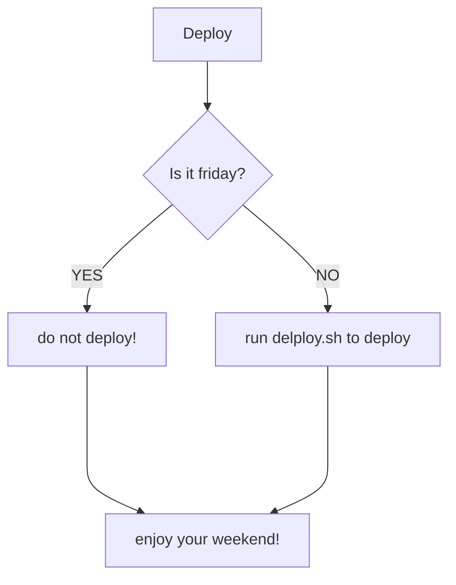

```mermaid
flowchart TD
A[Deploy] --> B{Is it friday?};
B -- YES --> C[do not deploy!];
B -- NO --> D[run delploy.sh to deploy];
C ----> E[enojoy your weekend!];
D ----> E[enjoy your weekend!];
```

